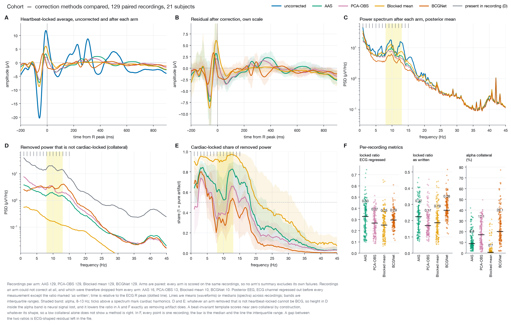
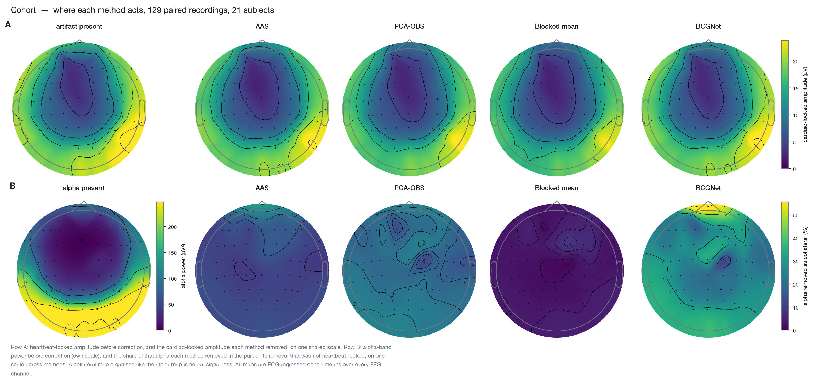

# EEG-fMRI Ballistocardiogram (BCG) Correction

A scientific computing framework for the standardized correction and comparative evaluation of ballistocardiogram (BCG) artifacts in simultaneous EEG-fMRI recordings following gradient artifact suppression.

## Overview

Cardiovascular pulsatile activity inside high-field magnetic resonance scanners induces large-amplitude ballistocardiogram (BCG) artifacts on scalp electroencephalography. This software provides an integrated pipeline to benchmark and execute four correction methodologies under standardized physiological constraints:

1. **Average Artifact Subtraction (AAS)**: Moving-window sliding template subtraction aligned to detected electrocardiographic R-peaks (Allen et al., 1998).
2. **Principal Component Analysis Optimal Basis Set (PCA-OBS)**: Subspace projection onto principal components derived from cardiac-aligned artifact templates (Niazy et al., 2005).
3. **Cross-Fitted Blocked Mean**: Contiguous non-overlapping block cross-fitting with beat-invariant temporal templates.
4. **BCGNet (Recurrent Neural Network)**: Deep gated recurrent unit (GRU) network trained directly on single-lead electrocardiography (ECG) to predict multi-channel BCG artifacts without requiring cardiac peak markers (McIntosh et al., 2020).

No single method is treated as a default. Study pipelines evaluate each arm under unified validation criteria using `bcg compare`.

---

## Empirical Benchmark & Comparative Evaluation

Artifact suppression cannot be evaluated purely by total residual variance or broadband power reduction. An overly aggressive filter or over-subtracting template can artificially minimize residual variance by attenuating endogenous neural oscillations. To address this, corrections are evaluated using two joint criteria:
- **Heartbeat-Locked Residual Ratio**: The fraction of cardiac-locked energy remaining post-correction (lower indicates greater artifact removal).
- **Spectral Specificity & Collateral Loss**: The fraction of removed signal that is phase-locked to cardiac cycles. Power removed outside cardiac harmonics—particularly in the physiological alpha band (8–13 Hz)—represents unintended loss of neural activity.

### Cohort Comparison

The comparative report below evaluates **129 paired acquisitions across 21 participants** under identical cardiac peak alignments:



*Figure 1: Cohort comparative report across 129 paired recordings (21 subjects). (A) Heartbeat-locked waveform average before and after correction. (B) Residual waveform on an independent amplitude scale. (C) Posterior channel power spectral density (PSD); vertical ticks mark cardiac harmonics, shaded area indicates the alpha band (8–13 Hz). (D) Non-cardiac-locked power removed (collateral loss). (E) Spectral specificity across frequencies (cardiac-locked fraction of removed power). (F) Per-recording metric distributions.*

### Scalp Topographies

Scalp topographies evaluate spatial selectivity across all 63 channels. BCG artifacts are primarily peripheral and head-motion-driven, whereas physiological alpha rhythms originate predominantly from occipital and parietal cortices.



*Figure 2: Cohort scalp topographies. Row A: Baseline cardiac-locked amplitude and the corresponding locked amplitude removed by each method on a shared scale. Row B: Baseline alpha-band power and the non-locked alpha power removed as collateral loss. Topographical similarity between baseline alpha and collateral loss denotes neural signal attenuation.*

### Summary of Cohort Performance

| Method | Heartbeat-Locked Ratio (ECG-Regressed) | Spectral Specificity | Alpha Collateral Loss (%) |
| :--- | :---: | :---: | :---: |
| **AAS** | 0.33 | 0.86 | 8.8% |
| **PCA-OBS** | 0.27 | 0.72 | 12.4% |
| **Blocked Mean** | 0.26 | 0.98 | 0.5% |
| **BCGNet** | 0.30 | 0.70 | 15.6% |

*Median metrics across 129 paired recordings. Lower locked ratios indicate greater artifact attenuation; higher specificity and lower collateral loss indicate preservation of endogenous neural rhythms.*

---

## Installation

The package requires Python 3.12 and `uv` for reproducible environment management.

```bash
git clone https://github.com/JoshuaDuq/eeg-fmri-bcg.git
cd eeg-fmri-bcg
uv sync
```

---

## Execution & Workflow

All pipeline operations are accessed through the unified `bcg` command-line entry point (`src/bcgstudy/cli.py`). Subcommands execute independently and do not depend on preceding steps.

```bash
# 1. Discover recordings and verify subject-run mappings without processing
uv run bcg discover --config config.yaml

# 2. Execute desired correction pipelines
uv run bcg aas          --config compare.yaml
uv run bcg pca-obs      --config compare.yaml
uv run bcg blocked-mean --config compare.yaml
uv run bcg bcgnet       --config config.yaml

# 3. Generate comparative evaluation tables and figures
uv run bcg compare --config compare.yaml

# 4. Rebuild figures from serialized profiles without re-running corrections
uv run bcg reports --config compare.yaml
```

To correct a single BrainVision acquisition outside a cohort:
```bash
uv run bcg correct --config examples/bcg_correction.yml
```

### Subcommand Reference

| Command | Configuration | Output Description |
| :--- | :--- | :--- |
| `bcg discover` | `config.yaml` | Identifies available BIDS recordings and displays subject/run tables. |
| `bcg aas` | `compare.yaml` | Writes `*_fastr_aas.vhdr` and per-recording profiles under `paths.aas_root`. |
| `bcg pca-obs` | `compare.yaml` | Writes `*_fastr_pcaobs.vhdr` and per-recording profiles under `paths.pca_obs_root`. |
| `bcg blocked-mean` | `compare.yaml` | Writes `*_fastr_blockedmean.vhdr` and profiles under `paths.blocked_mean_root`. |
| `bcg bcgnet` | `config.yaml` | Trains subject GRU models; writes `*_fastr_bcgnet.vhdr` and `cohort_summary.csv`. |
| `bcg compare` | `compare.yaml` | Generates `compare_summary.csv`, comparative figures, and topographies. |
| `bcg reports` | `compare.yaml` | Rebuilds cohort figures directly from existing `*_profile.npz` archives. |
| `bcg detect` | `compare.yaml` | Executes independent QRS detection on ECG channels. |
| `bcg benchmark` | `compare.yaml` | Computes signal transfer on synthetic calibration injections. |

---

## Signal Processing & Methodology

The repository enforces clean separation of concerns:
- **`src/bcgstudy/`**: Top-level CLI orchestration and dataset discovery.
- **`src/bcg_correction/`**: QRS detection (`cardiac.py`), bounded corrections (`bcg.py`), analytical metrics (`metrics.py`), and visualization (`figure_style.py`, `correction_report.py`).
- **`src/bcgnet/`**: Vendor GRU neural network training, inference, and sinc interpolation writeback (`export.py`, `writeback.py`).
- **`src/bcgnet/compare/`**: Multi-arm evaluation engine and comparative figure generation (`comparative.py`, `pipeline.py`).
- **`tools/`**: Statistical verification and holdout evaluation scripts.

### Key Processing Standards

1. **Non-destructive File Operations**: Corrected BrainVision datasets (`.vhdr`, `.eeg`, `.vmrk`) are written to separate output directories with explicit method suffixes (`_aas`, `_pcaobs`, `_blockedmean`, `_bcgnet`). Raw and FASTR gradient-corrected inputs are never overwritten.
2. **Frequency Domain Alignment**: Bounded methods operate at native acquisition sampling rates (e.g., 1000 Hz). BCGNet trains on downsampled 100 Hz data and maps predicted BCG traces back to 1000 Hz via polyphase sinc interpolation prior to subtraction, preserving non-cardiac high frequencies.
3. **RR Interval Validation**: Heartbeat intervals below physiological limits ($RR < \text{minimum}$) indicate false detections and abort processing to prevent artifact injection. Prolonged intervals ($RR > \text{maximum}$) indicate missed beats and are annotated with `Bad_BCG` markers without subtracting unanchored templates.

---

## Configuration

Study parameters are maintained in dedicated YAML configuration files:
- **`config.yaml`**: BCGNet training parameters, architecture dimensions, and dataset roots.
- **`compare.yaml`**: Bounded correction parameters (epoch windows, delays, PCA components, neighbor counts) and comparison roots.
- **`examples/`**: Template configuration files with standardized placeholder directories.

---

## Verification & Testing

The test suite validates numerical equivalence, edge cases, and architectural boundaries across all modules:

```bash
uv run pytest
uv run ruff check src tests tools
```

All 393 unit and integration tests must pass cleanly.

---

## References

- Allen, P. J., Polizzi, G., Krakow, K., Fish, D. R., & Lemieux, L. (1998). Identification of EEG events in the MR scanner: the problem of pulse artifact and a method for its subtraction. *NeuroImage*, 8(3), 229–239.
- Niazy, R. K., Xie, J., Miller, P., & Smith, S. M. (2005). Spectral and spatial characteristics of the ballistocardiogram artifact in simultaneous EEG-fMRI. *NeuroImage*, 28(3), 720–737.
- McIntosh, J. R., Yao, J., Hong, L., Faller, J., & Sajda, P. (2020). Ballistocardiogram artifact reduction in simultaneous EEG-fMRI using deep learning. *IEEE Transactions on Biomedical Engineering*, 68(1), 78–89.
